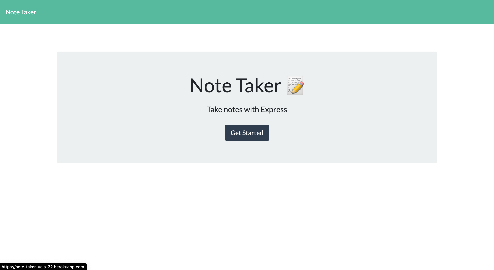
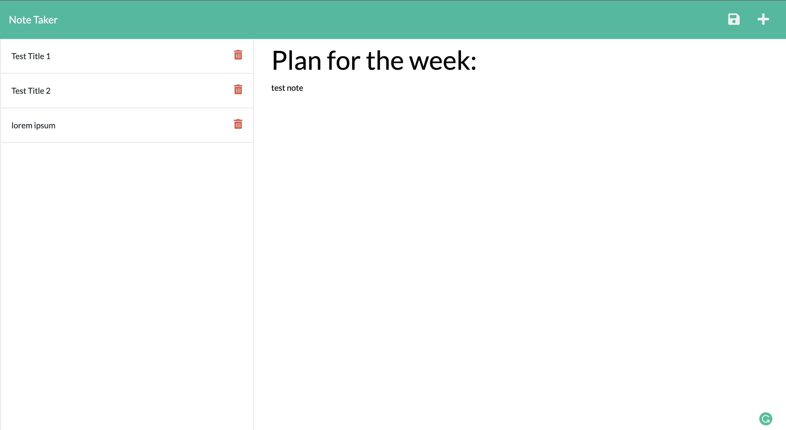

<h1 align="center"> 📝 Note Taker 📝 </h1>

 
## Description
This is a note taker app that will show notes, create new notes, and delete notes no longer needed when user specifies.  This app is great for professionals who need to make a quick note or students who have to look back to prior notes and delete them as needed.

## Table of Contents
- [Description](#description)
- [Installation](#installation)
- [Usage](#usage)
- [License](#license)
- [Contributing](#contributing)
- [Tests](#tests)
- [Questions](#questions)
## Installation
Just run the application by going to <https://note-taker-ucla-22.herokuapp.com/>
## Usage
This is perfect for people who need to organize their life especially busy students who need to make a quick note.
## License

 
This application is covered by the MIT license. 
## Contributing
Taylor Hernandez
## Tests
Not right now.
## Questions
Just email hernandeztaylor1@gmail.com 
 
:octocat: Find me on GitHub: [TayHern](https://github.com/TayHern) 
 
Email me with any questions: hernandeztaylor1@gmail.com  
  
